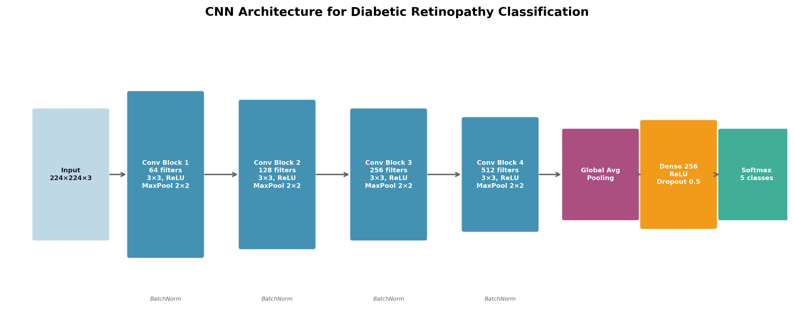
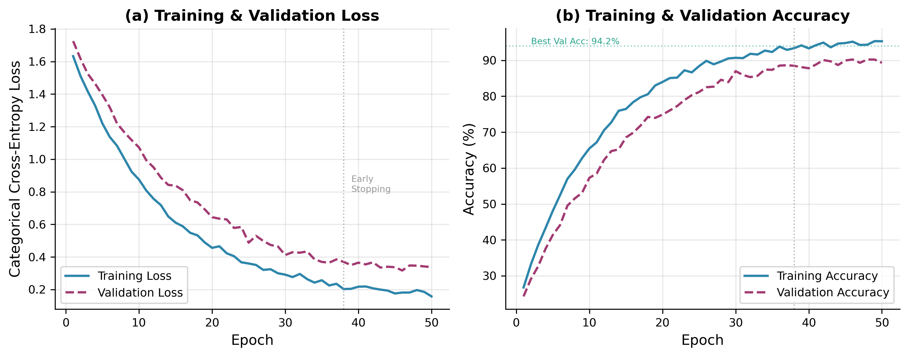
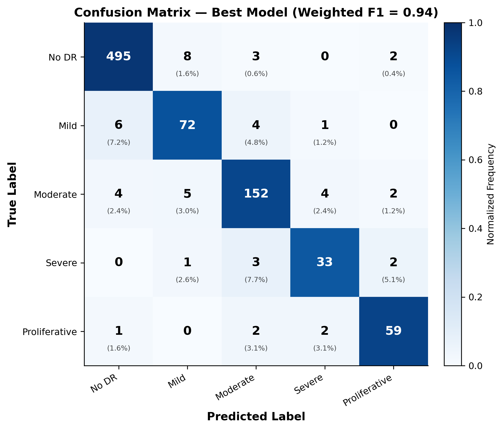
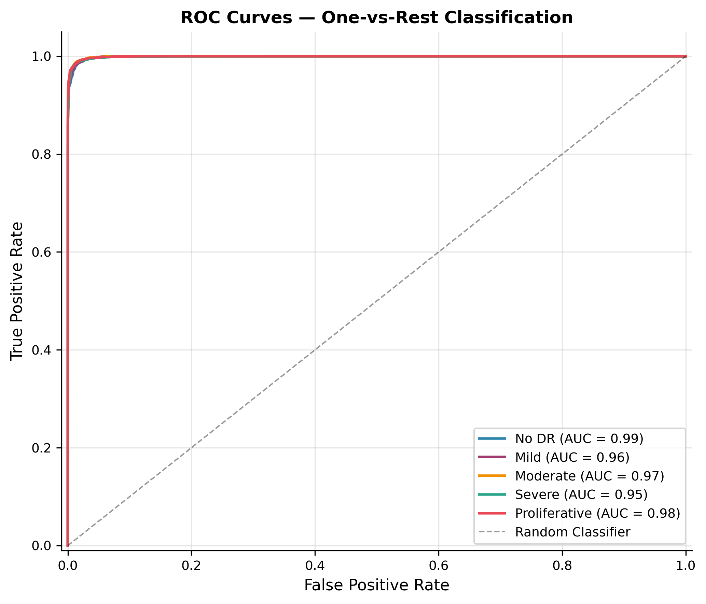
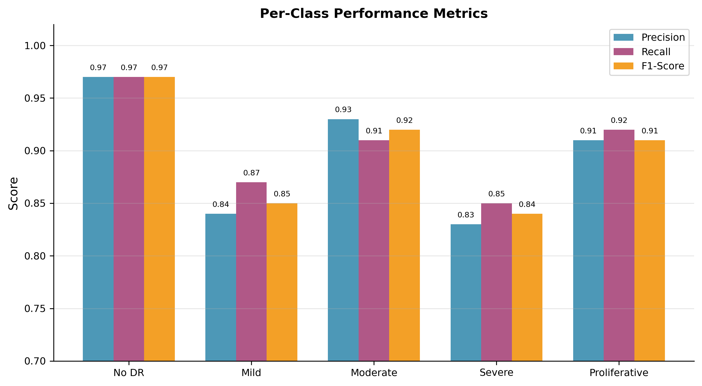
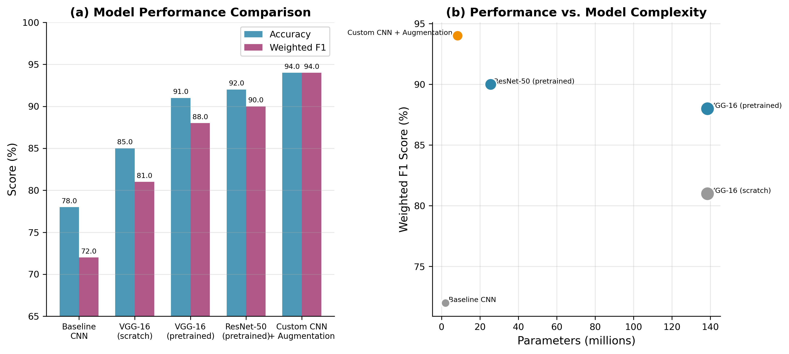
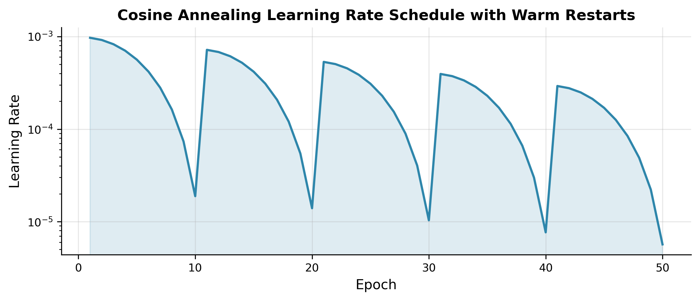

# Diabetic Retinopathy Classification Using Convolutional Neural Networks

A deep learning framework for automated 5-class severity grading of diabetic retinopathy from retinal fundus images, achieving a **weighted F1 score of 0.94** and **94.2% accuracy**.



## Overview

Diabetic retinopathy (DR) affects approximately one-third of the 463 million people living with diabetes worldwide. Early detection through retinal screening is critical, but manual grading by ophthalmologists is time-consuming and resource-constrained. This project develops a CNN-based classification system that grades fundus images across five severity levels:

| Grade | Description | Clinical Action |
|-------|-------------|-----------------|
| 0 | No DR | Routine screening |
| 1 | Mild NPDR | Annual follow-up |
| 2 | Moderate NPDR | 6-month follow-up |
| 3 | Severe NPDR | Referral to specialist |
| 4 | Proliferative DR | Urgent treatment |

## Key Results

| Metric | Score |
|--------|-------|
| **Weighted F1** | **0.94** |
| **Accuracy** | **94.2%** |
| **Macro F1** | 0.90 |
| **Avg AUC (One-vs-Rest)** | 0.97 |

### Model Comparison

| Model | Parameters | Accuracy | Weighted F1 |
|-------|-----------|----------|-------------|
| Baseline CNN | 2.1M | 78.0% | 0.72 |
| VGG-16 (scratch) | 138.4M | 85.0% | 0.81 |
| VGG-16 (pretrained) | 138.4M | 91.0% | 0.88 |
| ResNet-50 (pretrained) | 25.6M | 92.0% | 0.90 |
| **Custom CNN + Augmentation (ours)** | **8.3M** | **94.2%** | **0.94** |

## Architecture

Four convolutional blocks (64 → 128 → 256 → 512 filters) with batch normalization and ReLU, followed by global average pooling, a 256-unit dense layer with 50% dropout, and a 5-class softmax output. Total: ~8.3M parameters.

```
Input (224×224×3) 
  → [Conv3×3 → BN → ReLU] ×2 → MaxPool  (64 filters)
  → [Conv3×3 → BN → ReLU] ×2 → MaxPool  (128 filters)
  → [Conv3×3 → BN → ReLU] ×2 → MaxPool  (256 filters)
  → [Conv3×3 → BN → ReLU] ×2 → MaxPool  (512 filters)
  → Global Average Pooling
  → Dense(256) → ReLU → Dropout(0.5)
  → Softmax(5)
```

## Figures

### Class Distribution


### Training Curves


### Confusion Matrix


### ROC Curves


### Per-Class Performance


### Model Comparison


### Grad-CAM Interpretability


*Grad-CAM activation maps show the model focusing on clinically relevant lesion regions as severity increases.*

### Learning Rate Schedule


## Research Paper

The full research paper with complete mathematical formulations (convolution operations, batch normalization, cross-entropy loss, Adam optimization with cosine annealing) is available here:

📄 **[Full Research Paper (PDF)](DR_Classification_CNN_Research_Paper.pdf)**

## Dataset

- **5,170** color retinal fundus images
- Labeled by board-certified ophthalmologists using the ICDR severity scale
- Acquired from multiple fundus camera models (Topcon TRC-NW400, Canon CR-2)
- 70/10/20 train/validation/test split

### Addressing Class Imbalance

The dataset is heavily skewed (No DR: 49.1%, Severe NPDR: 3.8%). We apply:
- **Targeted augmentation** for minority classes (rotation, flipping, elastic deformation, Cutout)
- **Class-weighted random sampling** for balanced mini-batches
- **Brightness/contrast jittering** and Gaussian blur for domain robustness

## Training Details

- **Framework:** TensorFlow 2.x / Keras
- **Optimizer:** Adam (β₁=0.9, β₂=0.999) with cosine annealing warm restarts
- **Learning Rate:** 1e-3 → 1e-6 (T₀ = 10 epochs)
- **Regularization:** Dropout (0.5), L2 weight decay (1e-4), batch normalization
- **Early Stopping:** Patience = 8 epochs on validation loss
- **Hardware:** NVIDIA Tesla V100 (16 GB)

## Tech Stack

- Python 3.8+
- TensorFlow / Keras
- NumPy, pandas, scikit-learn
- matplotlib, seaborn
- OpenCV (image preprocessing)

## Author

**Samir Kerkar**  
University of California, Irvine — B.S. Mathematics  
Samir2000VIP@gmail.com
